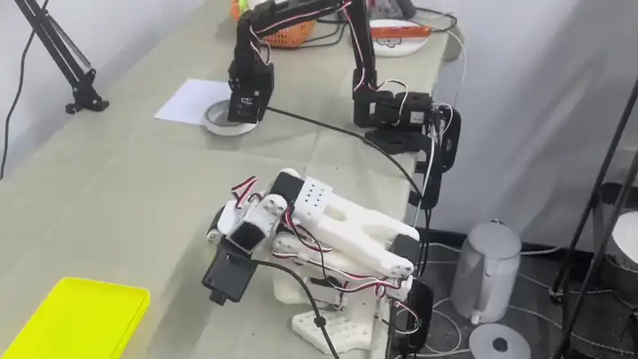

# Pass 双面胶 — 双臂 SO101 × SmolVLA

双臂 **Pass（交接）** 实验仓库：抓取双面胶卷 → 递给另一臂 → 放入黄色长方形塑料盘。

> 任务指令：  
> `Grasp the double-sided tape roll, hand it over to the other arm, and place it in the yellow rectangular plastic tray.`
>
> 成功标准：第一臂抓住胶带 → 交接给另一臂 → 放入黄盘；时限内；**零人工干预**。

本仓库用中文写清 **采集 → 训练 → 离线检查 → 真机评测** 全流程，并附可复现脚本。基于 [LeRobot](https://github.com/huggingface/lerobot) + **SmolVLA**，硬件为双臂 SO101（12 DoF）+ 4 相机。

| 项目 | 数值 |
|------|------|
| 主数据（4cam） | **89** episodes / **47,074** frames @ 30 FPS |
| 机器人 | `bi_so101_follower`，动作/状态各 12 维 |
| 相机 | `top_left` / `top_right` / `left` / `right` |
| 策略 | SmolVLA（~450M） |
| 训练 | 计划 200k step，手动停在 ~120k；2×3090，batch 4/卡（effective 8） |
| 真机甜区 ckpt | **`060000`**（约 20 epoch 口径） |
| Latency（参考） | ~**148 ms** / `select_action`（3090，同架构蓝块任务测得） |
| 真机 SR（informal） | ≈ **2/3（≥50%）**，N≈3；瓶颈在 **右臂抓取不准 / 空抓**（不是交接） |
| 真机 infer 视频 | [`videos/eval_pass_tape.mp4`](videos/eval_pass_tape.mp4)（约 79 s，H.264）· [HTML 预览](docs/eval_player.html) |
| 关键结论 | 事先以为 **胶带交接** 会出问题；真机失败主因是 **right arm 有时不能准确抓住 tape** |

> **未上传：** 原始数据集（~481 MB）与 checkpoint（整次训练约 18 GB）。本地路径见文末。

### Eval 预览（打开 README 即可看）

<p align="center">
  
</p>

完整 mp4（约 79 s）：[`videos/eval_pass_tape.mp4`](videos/eval_pass_tape.mp4) · [Release 下载](https://github.com/upnana/pass_tape/releases/download/eval-demo/eval_pass_tape.mp4) · [HTML 播放器](docs/eval_player.html)

对照实验：[stack_bowls（三色叠碗）](https://github.com/upnana/stack_bowls)。

---

## 仓库结构

```text
pass_tape/
├── README.md                 # 本文件（中文全流程）
├── scripts/
│   ├── get-data-bimanual.sh
│   ├── train_smolvla_bimanual_4cam_20260717.sh   # ★ 主训练
│   ├── train_smolvla_bimanual.sh                 # 旧 3cam
│   ├── infer_smolvla_bimanual_4cam_20260717_ep20.sh  # ★ 主推理
│   ├── infer_smolvla_bimanual_4cam_20260717_ep{18,22,25,39}.sh
│   └── infer_smolvla_bimanual.sh                 # 旧 3cam
├── notes/
│   └── smolvla-bimanual-handover-tape-experiment.md
├── docs/
│   ├── eval_player.html             # ★ 浏览器预览真机视频
│   ├── bimanual_smolvla_project_summary_zh.md
│   ├── dataset_info_4cam.json
│   ├── train_config_060000.json
│   └── policy_config_060000.json
└── videos/
    ├── eval_pass_tape.mp4           # 真机闭环（~79 s，H.264）
    ├── eval_pass_tape_poster.jpg
    ├── eval_pass_tape_preview.webp
├── eval_pass_tape_preview.gif
    └── index.html                   # ★ 打开即可浏览器预览
```

脚本默认 `PROJECT_ROOT=/home/rxn/lerobot`、conda 环境 `lerobot`，可按本机路径改环境变量。

---

## 0. 前置条件

### 硬件

- 左/右 SO101 **follower** + 左/右 **leader**（遥操作）
- 4 路相机：`top_left` / `top_right` / `left` / `right`，MJPG @ **30 FPS**
- 训练建议 2×3090；真机推理 1 张卡即可

### 软件

```bash
cd /home/rxn/lerobot
conda activate lerobot
pip install -e ".[smolvla,feetech]"
# 基座权重：lerobot/smolvla_base + SmolVLM2（本地缓存）
```

### 设备检查（务必用 by-id）

```bash
ls -la /dev/serial/by-id/
ls -la /dev/v4l/by-id/
bash scripts/get-data-bimanual.sh cameras
```

USB 相机易掉线：拔插、杀掉残留 preview（`fuser`），再重新核对 `by-id`。

---

## 1. 任务设计

子技能链：

```text
grasp(双面胶)  →  handover(递给另一臂)  →  place(黄盘)
```

经验结论：**瓶颈在右臂（抓取臂）对 tape 的准确定位与夹取，不在双臂交接。**  
事先预期「handover 难」，真机观察却是：只要抓住，pass + 入盘很少错；失败多为 right arm **抓偏 / 空抓**。

采集建议：

1. 打乱胶带起始位姿，黄盘位置相对固定。
2. 删掉 / 重录 **空抓、抓偏** demo，质量优先于盲目加 episode。
3. 保证腕相机能看见胶带卷，尤其强化 **右臂接近与闭合** 段。
4. 任务文本写全三步（4cam 已写全；旧 3cam 文本偏泛）。

---

## 2. 数据采集

### 2.1 主路径：4 相机

```bash
conda activate lerobot

bash scripts/get-data-bimanual.sh cameras
bash scripts/get-data-bimanual.sh preview4   # 如有
bash scripts/get-data-bimanual.sh            # 开始录制

# 续录示例
RESUME=1 bash scripts/get-data-bimanual.sh
```

本实验主库：

| 项 | 值 |
|----|-----|
| 路径 | `/home/rxn/datasets/bimanual_handover_4cam_20260717_150424` |
| Episodes | **89** |
| Frames | **47,074** |
| FPS | 30 |
| 平均时长 | ~17.6 s/ep |
| `robot_type` | `bi_so101_follower` |
| 图像键 | `observation.images.{top_left,top_right,left,right}` |

元数据快照：`docs/dataset_info_4cam.json`。

### 2.2 前身：3 相机（对照）

| 项 | 值 |
|----|-----|
| 路径 | `/home/rxn/datasets/bimanual_handover` |
| Episodes / Frames | **80 / 65,301** |
| 相机 | `top` / `left` / `right` |
| 教训 | 训满 150k、loss→0.001 后真机易 **悬停**；必须用中期 ckpt |

---

## 3. 训练（SmolVLA）

### 3.1 相机映射

```text
top_left  → camera1
top_right → camera2
left      → camera3
right     → camera4
```

### 3.2 启动（4cam 主线）

```bash
NUM_GPUS=2 CUDA_VISIBLE_DEVICES=0,1 \
  bash scripts/train_smolvla_bimanual_4cam_20260717.sh

# 后台 / 续训 / 清空重开（以脚本内变量为准）
BACKGROUND=1 ... bash scripts/train_smolvla_bimanual_4cam_20260717.sh
RESUME=1 bash scripts/train_smolvla_bimanual_4cam_20260717.sh
```

### 3.3 本跑超参与结果

| 项 | 值 |
|----|-----|
| 计划 Steps | 200,000 |
| 实际 | 手动停在 **~120,000** |
| Batch/GPU | 4 → effective **8** |
| @120k data-epoch | \(120000×8/47074 ≈\) **20.4** |
| 日志 `epch` @120k | ≈40.7（tracker 口径约为 data-epoch×2；对外请报 **step** 或 frames 公式） |
| 停训 loss | ~0.027–0.029 |
| 真机甜区 | **`060000`–`080000`**；再往后偏过拟合 |

```text
outputs/train/smolvla_bimanual_4cam_20260717_150424/checkpoints/
  060000/pretrained_model   # ★ 主推真机（ep20 脚本默认）
  070000 / 080000           # 邻近甜区
  120000 / last             # 停训点，偏晚
```

**统一结论（与叠碗一致）：** 双臂长 horizon BC 用 **中期 ckpt + 真机 SR** 选模，不要只看最终 loss。

---

## 4. 离线健康检查（可选）

```bash
bash scripts/infer_smolvla_bimanual_4cam_20260717_ep20.sh offline
bash scripts/infer_smolvla_bimanual_4cam_20260717_ep20.sh viz
```

| 模式 | 测什么 | 不代表什么 |
|------|--------|------------|
| Offline MAE | pred vs GT 关节 | 任务成功 |
| Replay | 回放示教 | 闭环纠错 |
| **真机 SR** | 零干预任务成功 | 需要固定协议 + 足够 N |

---

## 5. 真机评测

### 5.1 协议

\[
SR = \#成功 / N
\]

成功 = 抓胶带 → 交接 → 入黄盘 + 时限内 + 零干预。正式汇报建议 \(N \ge 10\)。

### 5.2 预检与运行

```bash
bash scripts/infer_smolvla_bimanual_4cam_20260717_ep20.sh cameras

CHECKPOINT=/home/rxn/lerobot/outputs/train/smolvla_bimanual_4cam_20260717_150424/checkpoints/060000/pretrained_model \
  NUM_EPISODES=10 \
  bash scripts/infer_smolvla_bimanual_4cam_20260717_ep20.sh robot
```

邻近 epoch 对比：

```bash
bash scripts/infer_smolvla_bimanual_4cam_20260717_ep18.sh robot
bash scripts/infer_smolvla_bimanual_4cam_20260717_ep22.sh robot
bash scripts/infer_smolvla_bimanual_4cam_20260717_ep25.sh robot
```

### 5.3 推理关键参数

| 参数 | 本实验 | 说明 |
|------|--------|------|
| `EPISODE_TIME_S` | **65** | 任务时限（Inference / episode duration） |
| `RESET_TIME_S` | 5 | trial 间隔 |
| 控制 FPS | **30** | 周期预算 ≈ 33 ms |
| `n_action_steps` | **5** | 训练 chunk 默认 50；真机缩短更跟手 |
| `max_relative_target` | 50 | 相对动作限幅 |

### 5.4 Latency · Inference time · SR（分析）

面试 / 写报告时把三个「时间 / 成功率」拆开，不要混谈：

| 名词 | 含义 | 本实验量级 | 说明 |
|------|------|------------|------|
| **Policy latency** | 一次 `select_action` 前向 | ~**148–150 ms**（~6.8 Hz，3090） | 同架构蓝块任务参考；本任务未单独重测 |
| **Control rate** | 往关节发指令的频率 | **30 Hz**（预算 ≈ 33 ms/帧） | latency ≫ 33 ms → **必须 action chunk** |
| **Inference / episode time** | 单次真机评测时限 | **`EPISODE_TIME_S=65`** | 这是任务墙钟上限，不是 148 ms |
| **有效重规划周期** | 新观测再开一段 chunk | ≈ \(5/30 ≈ 0.17\) s | `n_action_steps=5` |
| **Success Rate (SR)** | 零干预任务成功比例 | informal **≈ 2/3（≥50%）**，N≈3 | 正式建议 \(N\ge10\) |

**SR 与失败归因（核心）：**

> 一开始以为难点在 **胶带交接（handover）**——双臂对接、传物容易失手。  
> 真机评测后发现：主要失败点在于 **right arm 有时不能准确抓住 tape**（抓偏 / 空抓）。  
> 一旦右臂夹稳进入 handover，后续传给另一臂、放入黄盘 **很少再出错**。

因此：

\[
P(\text{full success}) \approx P(\text{right-arm grasp}) \times P(\text{pass+place}\mid\text{grasp})
\]

经验上 \(P(\text{pass+place}\mid\text{grasp})\) 很高 → 提升 SR 应优先做 **右臂抓取段**（更多成功抓取 demo、清洗空抓、腕相机对准 tape），而不是只堆交接数据。

对照 3cam 训满悬停：修好过拟合与控制后，能力上限落在 **感知–抓取**，而不是「整段不动」或「交接必炸」。

### 5.5 Informal 结果（甜区 ckpt）

| 项 | 值 |
|----|-----|
| Trials | ≈ 3 |
| 成功 | ≈ 2 |
| **SR** | **≈ 2/3 ≈ 67%**（可报 ≥50%；N 小） |
| 预期难点 | 胶带交接 |
| **实际主失败** | **right arm 抓取不准 / 空抓** |
| 条件规律 | 抓住后 pass + 入盘基本成功 |

**真机推理视频：** 见上方 **Eval 预览**（README 内嵌动画）· 完整 [`videos/eval_pass_tape.mp4`](https://github.com/upnana/pass_tape/releases/download/eval-demo/eval_pass_tape.mp4)

### 5.6 失败模式（补充）

1. **预期 vs 现实：** 以为 handover 会出问题 → 实际是右臂 first grasp。
2. **抓取难、交接易：** 圆柱胶带对位容差小、深度/遮挡敏感；持物后的 pass/place 示教更一致，BC 更好学。
3. **改进方向：** 加右臂接近与闭合多样性；删空抓段；保证 `right` / 腕相机可见 tape；正式扫 18/20/25 ep ckpt，\(N\ge10\)。

---

## 6. 工程踩坑

| 问题 | 处理 |
|------|------|
| USB 相机掉线 / by-id 漂移 | 推理前重列设备并覆盖相机变量 |
| 双臂视频时间戳漂移 | `tolerance_s=0.05` |
| Feetech 电压错误（曾遇右臂 id=5） | 检查供电 / 线材，否则打断评测 |
| 日志 epch 与 data-epoch 差约 2× | 对外报 step 或 frames 公式 |

---

## 7. 端到端清单

```text
[ ] 1. 四串口 + 四相机 by-id 可见
[ ] 2. 采集：bash scripts/get-data-bimanual.sh
[ ] 3. QC：删空抓 / 重录；viz 抽查
[ ] 4. 训练：NUM_GPUS=2 bash scripts/train_smolvla_bimanual_4cam_20260717.sh
[ ] 5. 离线：infer ..._ep20.sh offline
[ ] 6. 真机：cameras → robot（默认 ckpt 060000）
[ ] 7. 按真机 SR 扫 18/20/22/25 ep；正式 N≥10
[ ] 8. 记录失败：空抓？交接？入盘？超时？
```

---

## 8. 本地大文件路径（未 push）

| 用途 | 路径 |
|------|------|
| 4cam 数据 | `/home/rxn/datasets/bimanual_handover_4cam_20260717_150424` |
| 3cam 数据 | `/home/rxn/datasets/bimanual_handover` |
| 4cam 训练 | `/home/rxn/lerobot/outputs/train/smolvla_bimanual_4cam_20260717_150424` |
| 甜区权重 | `.../checkpoints/060000/pretrained_model` |
| 推理脚本 | `bash scripts/infer_smolvla_bimanual_4cam_20260717_ep20.sh robot` |
| 训练日志 | `/home/rxn/lerobot/logs/smolvla_bimanual_4cam_20260717_150424.log` |

Config 快照（无权重）：`docs/*_060000.json`。

---

## 9. 数字速查

```text
任务        : 双面胶 grasp → handover → 黄盘（双臂）
数据(4cam)  : 89 ep / 47,074 fr @ 30 FPS / 12-DoF / 4 cams
训练        : 计划 200k，停 ~120k；甜区 ckpt 060000–080000
Infer       : Duration 65 s/ep | FPS 30 | n_action_steps=5
Latency 参考: ~148 ms/select_action（~6.8 Hz，3090）
控制预算    : 33 ms/帧 @ 30 Hz → 需要 action chunk
真机 SR     : ~2/3（≥50%），N≈3 informal
失败分析    : 预期难点=胶带交接；实际主失败=right arm 抓不准/空抓
条件规律    : 抓住后 pass+入盘很少失败
3cam 教训   : 150k loss~0.001 → 悬停；用中期 ckpt
```

更细的面试向叙述见 [`notes/smolvla-bimanual-handover-tape-experiment.md`](notes/smolvla-bimanual-handover-tape-experiment.md)。

---

## 说明

脚本与笔记来自本地 LeRobot / SO101 双臂实验。SmolVLA、LeRobot 遵循各自上游许可证。本仓库是 **Pass 双面胶** 任务的流程与实验归档。
